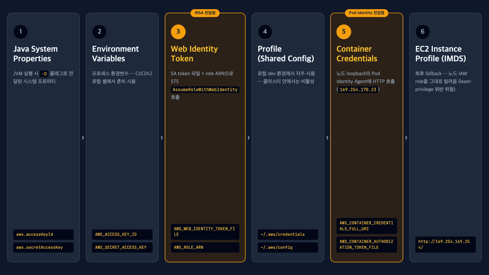
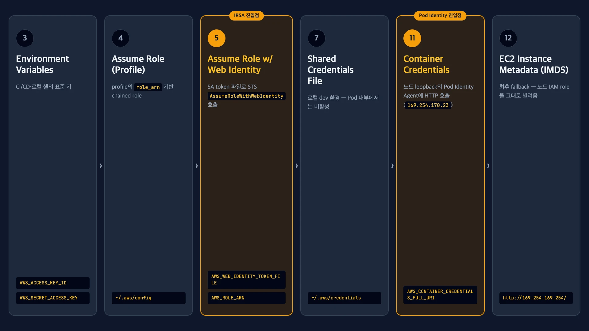
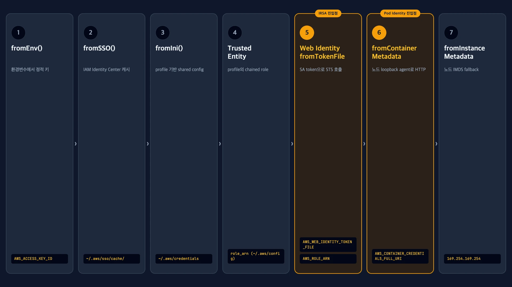
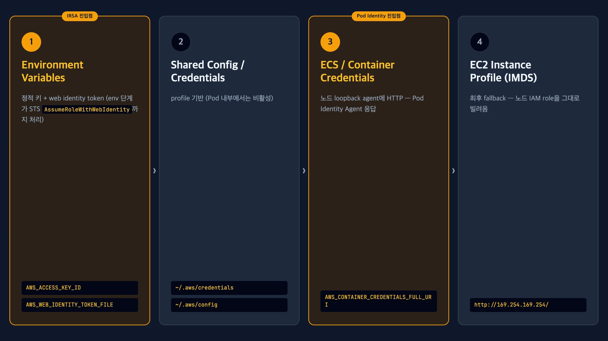
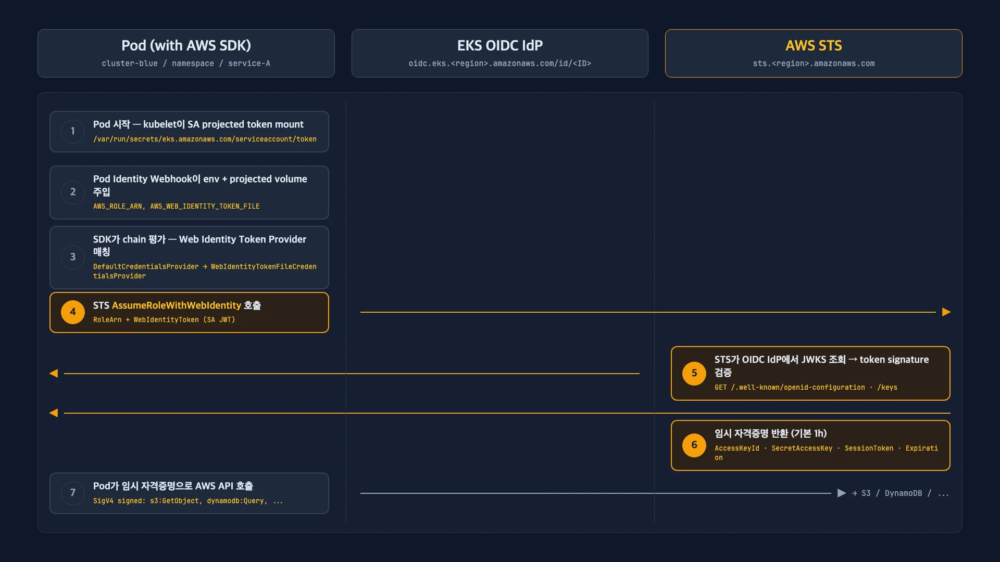
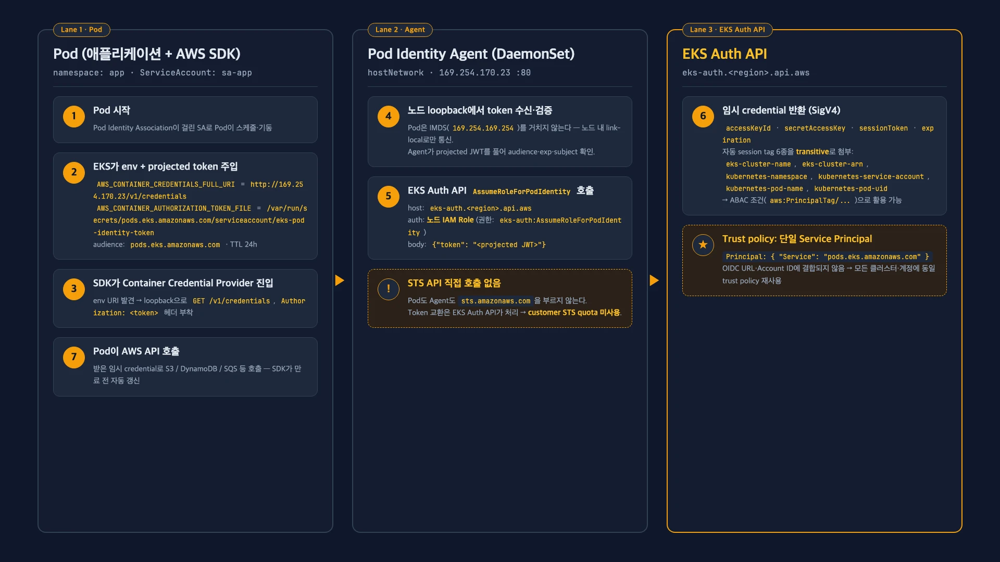
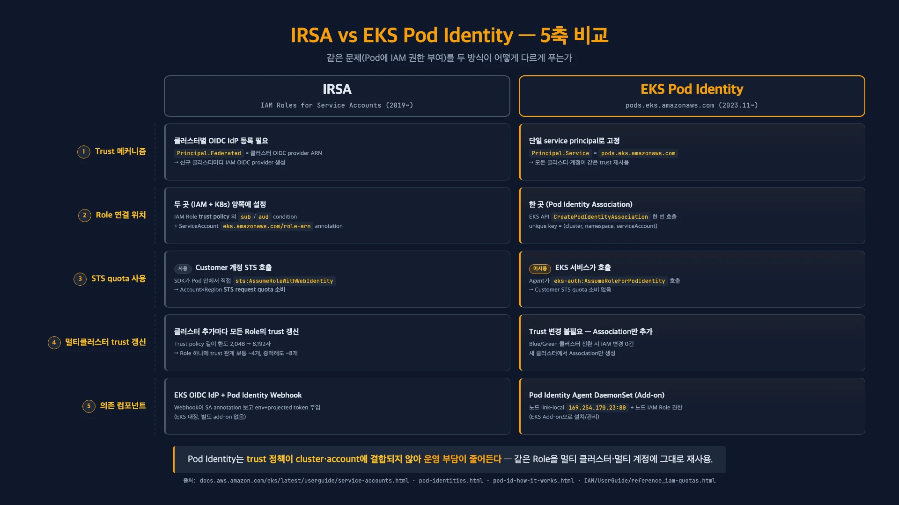
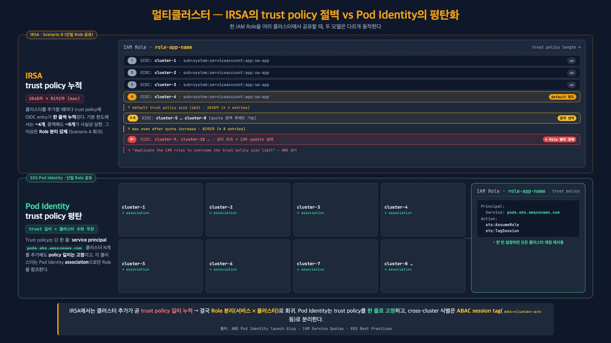

<!-- _class: title -->

# EKS Pod Identity로 더 간편하게
# Kubernetes 서비스 권한 관리하기

<div class="subtitle">

**김태지 (Ethan)**  
번개장터 DevSecOps Engineer

AWS KRUG 마곡 DevOps 소모임 · 2026-04-28

</div>

<!--
발표 멘트:

- 안녕하세요, 번개장터에서 DevSecOps Engineer를 맡고 있는 김태지입니다. 영어 이름은 Ethan이고요, 오늘 30분 동안 같이 이야기 나누게 돼서 반갑습니다.
- 저희 팀에서 EKS 클러스터 운영, IAM 권한 설계, 그리고 그 사이를 잇는 보안·관측 영역을 주로 맡고 있습니다. 그 과정에서 IRSA를 길게 운영해보다가 Pod Identity로 전환을 시작하게 됐고, 그때 마주친 운영 부담과 그 부담이 어떻게 바뀌는지를 오늘 공유드리려고 합니다.
- 발표는 운영자 관점에서 진행하겠습니다. 이론보다는 "어떤 장면에서 IRSA가 아프고, Pod Identity가 그 장면을 어떻게 다르게 그리는가" 쪽에 시간을 더 쓰겠습니다.
-->

---

<!-- _class: toc -->

## 목차

1. Pod가 AWS 리소스에 접근하는 방법 — credential provider chain
2. IRSA와 Pod Identity 구조 비교
3. 멀티클러스터 환경에서 IRSA의 운영 부담
4. Pod Identity가 그 부담을 어떻게 해소하는가
5. Pod Identity 동작 상세
6. 전환 시 운영 편의성 + 정리

<!--
발표 멘트:

- 오늘 30분 동안 크게 6가지 흐름으로 가겠습니다. 첫째, Pod가 AWS 리소스에 접근하는 방법, 즉 credential provider chain부터. 둘째, IRSA와 Pod Identity의 구조 비교. 셋째, 멀티클러스터에서 IRSA가 만드는 운영 부담. 넷째, Pod Identity가 그걸 어떻게 해소하는지.
- 다섯 번째로 Pod Identity 동작을 한 번 더 깊게 들어가서 agent와 EKS Auth API가 어떻게 연결되는지 보고, 마지막으로 전환 시 운영 편의성과 정리로 마무리합니다.
- 한 번에 흐름을 끊지 않고 가져가는 게 목표이니 질문은 마지막 Q&A에 모아주시면 좋겠고, 중간에 화면이 안 보이거나 음성 문제 있으면 손 들어 알려주세요.
-->

---

<!-- ============================================================
     Section 3 — Pod의 AWS 인증 방법 + Credential Provider Chain
     Source: research/01-credential-provider-chain.md
     Slides: 4 / Estimated: ~5 min
     ============================================================ -->

<!-- _class: large -->

## Pod 안에서 AWS API를 호출하려면?

- 애플리케이션이 S3·DynamoDB·SQS를 호출하려면 **AWS credential**이 필요하다
- 그런데 Pod에는 access key를 직접 박지 않는다 — 어디서 자격증명이 오는가?
- 답: **AWS SDK의 default credential provider chain**이 자동으로 찾아온다
- 이 chain의 동작을 알아야 IRSA·Pod Identity의 차이가 보인다

<!--
발표 멘트:

- Pod 안의 컨테이너가 S3나 DynamoDB, SQS 같은 AWS 리소스를 부를 때 AWS credential이 필요합니다. 그런데 우리는 Pod에 access key를 직접 넣지 않죠. 그러면 자격증명이 어디서 오느냐, 이게 오늘의 출발 질문입니다.
- 답은 AWS SDK가 가지고 있는 default credential provider chain입니다. SDK가 내부에서 정해진 순서대로 자격증명 출처를 찾아오는데, 이 순서를 알아야 IRSA와 Pod Identity가 어디에 어떻게 끼워져 있는지 보입니다.
-->

---

<!-- _class: diagram-focus -->

## AWS SDK Default Credential Provider Chain (Java v2 기준)



- **6단계 순차 탐색** — 첫 번째로 찾은 provider에서 종료 ("first wins")
- IRSA = **3rd Web Identity**, Pod Identity = **5th Container**
<small class="refs">출처 · <a href="https://docs.aws.amazon.com/sdk-for-java/latest/developer-guide/credentials-chain.html">sdk-for-java/credentials-chain</a> · <a href="https://docs.aws.amazon.com/eks/latest/userguide/pod-id-how-it-works.html">eks/pod-id-how-it-works</a></small>

<!--
발표 멘트:

- 이 다이어그램이 Java SDK v2 기준 6단계 chain입니다. system properties, 환경변수, web identity, profile, container, 그리고 마지막이 EC2 instance profile. 위에서 아래로 순차 평가하고, 첫 번째로 모든 필수 값을 갖춘 provider에서 멈춥니다. "first wins" 패턴이죠.
- 오늘 주인공 두 개만 짚고 가겠습니다. IRSA는 3번째 web identity 슬롯에서 동작하고, Pod Identity는 5번째 container 슬롯에서 동작합니다. 즉 둘 다 chain의 일부일 뿐이고, 같은 chain 안에서 자리만 다른 거예요.
-->

---

<!-- _class: diagram-focus -->

## Python (Boto3) — 12단계 중 핵심 6단계



- 전체 **12단계**, 그 중 5번째가 IRSA, 11번째가 Pod Identity (사이에 IAM Identity Center·shared credentials·legacy boto2 등이 있음)
- Java v2와 마찬가지로 **web identity가 container provider보다 먼저 평가** — 동일 Pod에 둘 다 있으면 IRSA 우선
<small class="refs">출처 · <a href="https://docs.aws.amazon.com/boto3/latest/guide/credentials.html">boto3/guide/credentials</a></small>

<!--
발표 멘트:

- boto3는 12단계 chain입니다. 너무 길어서 핵심 6단계만 추렸어요. IRSA가 5번째 web identity provider, Pod Identity가 11번째 container credential provider. 사이에 IAM Identity Center, shared credentials, legacy boto2 같은 단계가 끼어 있습니다.
- 핵심은 Java v2와 마찬가지로 web identity가 container provider보다 먼저 평가된다는 점입니다 — 같은 Pod에 둘 다 있으면 IRSA가 우선합니다. (8초)
-->

---

<!-- _class: diagram-focus -->

## JavaScript v3 (Node.js) — 7단계 default chain



- `defaultProvider` 7단계 — IRSA(`fromTokenFile`) **5th**, Pod Identity(`fromContainerMetadata`) **6th**
- 이름은 다르지만 **순서·환경변수 키는 Java와 동일** — IRSA가 한 단계 먼저
<small class="refs">출처 · <a href="https://docs.aws.amazon.com/sdk-for-javascript/v3/developer-guide/setting-credentials-node.html">sdk-for-javascript/v3/setting-credentials-node</a></small>

<!--
발표 멘트:

- JavaScript v3 SDK도 같은 패턴입니다. 7단계 chain의 5번째가 web identity (`fromTokenFile`), 6번째가 container (`fromContainerMetadata`). 함수 이름은 다르지만 환경변수 키는 Java/Python과 동일합니다.
- 결론은 동일 — IRSA가 한 단계 먼저. (8초)
-->

---

<!-- _class: diagram-focus -->

## Go v2 — 4단계 default chain



- env 단계 안에 **web identity token 처리까지 포함** (Java/Boto3/JS는 web identity가 별도 단계)
- 그래도 결과는 같다: **env 안의 IRSA 경로가 container(Pod Identity) 경로보다 먼저**
<small class="refs">출처 · <a href="https://docs.aws.amazon.com/sdk-for-go/v2/developer-guide/configure-gosdk.html">sdk-for-go/v2/configure-gosdk</a></small>

<!--
발표 멘트:

- Go v2는 가장 짧은 4단계입니다. 1번째 environment variables 단계 안에 정적 키와 web identity token 처리가 모두 포함돼요 — 그래서 별도 단계가 없는 것처럼 보이지만, 결과는 같습니다. env 안의 IRSA 경로가 3번째 ECS/Container 경로보다 먼저 평가되니까요.
- 정리하면 4개 SDK 모두 IRSA → Pod Identity 우선순위는 같습니다. (10초)
-->

---

<!-- _class: large -->

## 핵심 동작: First Match Wins, 그래서 IRSA가 먼저

- SDK는 chain을 위에서 아래로 순차 평가, **하나라도 매칭되면 멈춘다**
- IRSA 진입점: `AWS_WEB_IDENTITY_TOKEN_FILE` + `AWS_ROLE_ARN` (3rd)
- Pod Identity 진입점: `AWS_CONTAINER_CREDENTIALS_FULL_URI` + `_TOKEN_FILE` (5th)
- Java v2·Boto3·Node.js v3 모두 **web identity가 container provider보다 먼저** (Go v2는 별도 container provider로 동등 효과)
<small class="refs">출처 · <a href="https://docs.aws.amazon.com/eks/latest/best-practices/identity-and-access-management.html">eks/best-practices/identity-and-access-management</a> · <a href="https://docs.aws.amazon.com/sdkref/latest/guide/feature-container-credentials.html">sdkref/feature-container-credentials</a> · <a href="https://docs.aws.amazon.com/boto3/latest/guide/credentials.html">boto3/guide/credentials</a></small>

<!--
발표 멘트:

- 그래서 같은 Pod에 IRSA와 Pod Identity가 둘 다 설정돼 있으면 어떻게 될까요. chain 순서상 web identity가 먼저니까 IRSA가 먼저 매칭됩니다. SDK는 그 시점에 멈추고 Pod Identity 슬롯까지 안 내려가요.
- IRSA의 진입점은 `AWS_WEB_IDENTITY_TOKEN_FILE`과 `AWS_ROLE_ARN` 환경변수, Pod Identity의 진입점은 `AWS_CONTAINER_CREDENTIALS_FULL_URI`와 `AWS_CONTAINER_AUTHORIZATION_TOKEN_FILE`입니다. 어느 SDK를 쓰든 web identity가 container provider보다 먼저예요.
-->

---

<!-- _class: large -->

## 같은 Pod에 둘 다 있으면? — IRSA 우선 = 마이그레이션 안전망

- AWS 공식: "earlier in the chain… will continue to be used **even if you configure** an EKS Pod Identity association for the same workload"
- 즉, Pod Identity association을 먼저 만들어두고 → IRSA annotation 제거 → 자연스럽게 전환
- AWS는 가능한 경우 **EKS Pod Identity 사용을 권장**
- 그렇다면 IRSA와 Pod Identity는 정확히 어떻게 다른가? — 다음 섹션에서 구조 비교
<small class="refs">출처 · <a href="https://docs.aws.amazon.com/eks/latest/userguide/service-accounts.html">eks/userguide/service-accounts</a></small>

<!--
발표 멘트:

- 이 동작을 AWS가 의도적으로 설계했다는 게 중요합니다. AWS 공식 문서에 그대로 있어요 — "credentials earlier in the chain will continue to be used even if you configure an EKS Pod Identity association for the same workload." 즉 Pod Identity association을 먼저 만들어두고, 나중에 IRSA annotation을 떼면 자연스럽게 전환되는 거죠.
- AWS는 가능한 경우 Pod Identity 사용을 권장하고 있고, 마이그레이션 안전성도 chain 순서로 보장합니다. 그러면 두 방식이 정확히 어디서 다른가, 다음 섹션에서 구조 그림으로 비교해보겠습니다.
-->

---

<!-- ============================================================
     Section 4 — IRSA vs Pod Identity 구조 비교
     Source: research/02-irsa-architecture.md, research/03-pod-identity-architecture.md
     Slides: 4 / Estimated: ~5분 50초
     ============================================================ -->

<!-- _class: diagram-focus -->

## IRSA 구조: SDK가 STS를 직접 호출



- Pod Identity Webhook이 SA annotation을 보고 `AWS_ROLE_ARN`·`AWS_WEB_IDENTITY_TOKEN_FILE`·projected token volume 주입
- SDK가 token으로 STS `AssumeRoleWithWebIdentity` **직접 호출** → 임시 credential 수신
- 신뢰의 뿌리: **클러스터별 OIDC issuer** + IAM OIDC provider (per-cluster 등록 필요)
<small class="refs">출처 · <a href="https://docs.aws.amazon.com/eks/latest/userguide/iam-roles-for-service-accounts.html">eks/iam-roles-for-service-accounts</a> · <a href="https://docs.aws.amazon.com/STS/latest/APIReference/API_AssumeRoleWithWebIdentity.html">STS/AssumeRoleWithWebIdentity</a></small>

<!--
발표 멘트:

- IRSA는 신뢰의 출발점이 클러스터의 OIDC issuer입니다. EKS 클러스터마다 고유한 OIDC issuer URL이 있고, 그걸 IAM에 OIDC provider로 등록해야 IRSA가 동작합니다. per-cluster 등록이라는 게 뒤에서 다시 나옵니다.
- 흐름은 이렇습니다. ServiceAccount에 `eks.amazonaws.com/role-arn` annotation을 달면 EKS의 Pod Identity Webhook이 Pod에 `AWS_ROLE_ARN`, `AWS_WEB_IDENTITY_TOKEN_FILE`, 그리고 projected token volume을 자동 주입합니다. SDK는 그 토큰을 가지고 STS의 `AssumeRoleWithWebIdentity`를 직접 호출해서 임시 credential을 받아옵니다.
- 두 가지만 기억해주세요. 첫째, 신뢰의 뿌리가 클러스터별 OIDC issuer라서 trust policy가 클러스터마다 달라집니다. 둘째, STS를 SDK가 직접 호출합니다 — 이게 customer 계정 STS quota를 소비한다는 뜻입니다.
-->

---

<!-- _class: diagram-focus -->

## Pod Identity 구조: Agent가 노드에서 대신 받아옴



- 노드 DaemonSet **Pod Identity Agent**가 loopback `169.254.170.23:80`에서 대기
- SDK는 표준 **Container credential provider** slot에서 agent를 호출
- Agent가 EKS Auth API `AssumeRoleForPodIdentity` 호출 → 임시 credential 반환 (**SDK는 STS 미호출**)
- Trust policy Principal은 항상 `pods.eks.amazonaws.com` — **모든 클러스터·계정 동일**
<small class="refs">출처 · <a href="https://docs.aws.amazon.com/eks/latest/userguide/pod-id-how-it-works.html">eks/pod-id-how-it-works</a> · <a href="https://docs.aws.amazon.com/eks/latest/APIReference/API_auth_AssumeRoleForPodIdentity.html">eks/AssumeRoleForPodIdentity</a></small>

<!--
발표 멘트:

- Pod Identity는 그림이 다릅니다. 노드마다 DaemonSet으로 떠 있는 Pod Identity Agent가 loopback `169.254.170.23`의 80 포트에서 대기합니다. SDK는 표준 Container credential provider 슬롯에서 환경변수 `AWS_CONTAINER_CREDENTIALS_FULL_URI`를 보고 그 agent를 호출해요.
- agent가 받은 ServiceAccount projected token을 가지고 EKS Auth API의 `AssumeRoleForPodIdentity`를 호출합니다. 그러면 EKS service가 대신 role을 assume해서 임시 credential을 agent로 돌려주고, agent가 SDK에 전달합니다. 즉 SDK는 STS를 직접 부르지 않습니다.
- 그리고 trust policy의 Principal이 항상 `pods.eks.amazonaws.com`이라는 단일 service principal이에요. 클러스터·계정과 결합되지 않으니까 모든 클러스터에서 같은 trust policy를 그대로 재사용할 수 있습니다 — 이게 IRSA와의 가장 큰 차이입니다.
-->

---

<!-- _class: diagram-focus -->

## 한 장 비교: 신뢰·연결·운영의 5축



- **신뢰** OIDC IdP (per-cluster) → service principal (universal)
- **STS quota** customer 소비 → EKS service 호출 (미소비)
- **사전 요건** per-cluster OIDC provider → Agent add-on (Auto Mode 사전 설치)
<small class="refs">출처 · <a href="https://docs.aws.amazon.com/eks/latest/APIReference/API_CreatePodIdentityAssociation.html">CreatePodIdentityAssociation</a> · <a href="https://docs.aws.amazon.com/eks/latest/userguide/pod-id-minimum-sdk.html">pod-id-minimum-sdk</a></small>

<!--
발표 멘트:

- 이 표는 5개 축으로 압축한 비교입니다. 신뢰는 OIDC IdP per-cluster에서 service principal universal로, 연결은 SA annotation + Role trust에서 association 한 곳으로, STS quota는 customer 소비에서 EKS service 호출로 — 즉 customer 쪽에서는 미소비.
- 사전 요건도 다릅니다. IRSA는 클러스터마다 OIDC provider를 등록해야 하고, Pod Identity는 add-on 한 번 설치로 끝. 단 Pod Identity는 2023년 11월 이후 release된 SDK 최소 버전이 필요합니다 — 이건 마이그레이션 점검 포인트로 뒤에서 다시 나옵니다.
- 5개 축 중에서도 trust 메커니즘과 연결 지점이 운영 부담의 가장 큰 차이를 만듭니다. 그게 다음 섹션의 출발 질문입니다.
-->

---

## 그런데 왜 IRSA를 멀티클러스터에서 쓰면 곤란한가?

- IRSA trust policy는 **클러스터의 OIDC provider ARN**을 직접 박는다 — 클러스터별 별도 trust 항목 필요
- 클러스터를 추가할 때마다 **모든 IRSA Role의 trust policy 갱신** 필요

<div class="arn-example">
<span class="label">Trust policy의 Principal.Federated에 직접 박히는 OIDC provider ARN</span>
<span class="arn">arn:aws:iam::<span class="accent">123456789012</span>:oidc-provider/oidc.eks.ap-northeast-2.amazonaws.com/id/<span class="cluster-id">EXAMPLED539D4633E53DE1B71EXAMPLE</span></span>
<span class="note">앞부분 = 계정·리전 / 뒷부분 <code>id/&lt;UNIQUE_ID&gt;</code> = <strong>클러스터별 고유값</strong> — 클러스터 N개 = trust 항목 N줄</span>
</div>

<small class="refs">출처 · <a href="https://docs.aws.amazon.com/IAM/latest/UserGuide/reference_iam-quotas.html">IAM/reference_iam-quotas</a> · <a href="https://docs.aws.amazon.com/eks/latest/best-practices/identity-and-access-management.html">eks/best-practices/identity-and-access-management</a></small>

<!--
발표 멘트:

- IRSA의 trust policy는 클러스터의 OIDC provider ARN을 직접 박습니다. 그림에 보이는 `arn:aws:iam::<account>:oidc-provider/oidc.eks.<region>.amazonaws.com/id/<UNIQUE_ID>` — 앞부분은 계정·리전이지만 뒤의 `id/<UNIQUE_ID>` 부분이 클러스터별 고유값이에요.
- 즉 클러스터 N개 = trust policy에 N줄. 클러스터를 추가할 때마다 모든 IRSA Role의 trust policy를 갱신해야 한다는 뜻입니다. 이게 멀티클러스터 IRSA의 진짜 운영 부담입니다.
-->

---

<!-- ============================================================
     Section 5 — 멀티클러스터 IRSA 운영 함정 (NARRATIVE CORE)
     Source: research/05-multi-cluster-irsa-pitfalls.md
     Slides: 4 / Estimated: ~5분
     Note: 슬라이드 11에 번개장터 사례를 일반화 명칭으로만 1줄 첨가.
     ============================================================ -->

## EKS Cluster Upgrade (Blue/Green)

- `cluster-green` 신규 기동, 워크로드 이전 시작 → 어디선가 401
- 원인: 기존 IRSA Role의 trust policy에 새 OIDC provider 추가 **누락**
- AWS 공식: *"update the IAM role trust policy each time the role is used in a new cluster"*

<div class="arn-pair">
<div class="arn-example blue">
<span class="label">cluster-blue (기존)</span>
<span class="arn">arn:aws:iam::123456789012:oidc-provider/oidc.eks.ap-northeast-2.amazonaws.com/id/<span class="cluster-id">11111111111111111111111111111111</span></span>
</div>
<div class="arn-example green">
<span class="label">cluster-green (신규) — 모든 IRSA Role의 trust에 추가 필요</span>
<span class="arn">arn:aws:iam::123456789012:oidc-provider/oidc.eks.ap-northeast-2.amazonaws.com/id/<span class="cluster-id">22222222222222222222222222222222</span></span>
</div>
</div>

<small class="refs">출처 · <a href="https://aws.amazon.com/blogs/containers/amazon-eks-pod-identity-a-new-way-for-applications-on-eks-to-obtain-iam-credentials/">aws.amazon.com/blogs/containers/...pod-identity</a> · <a href="https://docs.aws.amazon.com/eks/latest/best-practices/identity-and-access-management.html">eks/best-practices/identity-and-access-management</a></small>

<!--
발표 멘트:

- 시나리오를 한 번 따라가 보겠습니다. `cluster-green`을 새로 띄우고 워크로드를 옮기기 시작했는데, 어느 순간 어디선가 401이 떨어집니다. 원인은 새 클러스터의 OIDC provider를 기존 IRSA Role의 trust policy에 추가하는 걸 누락한 거예요.
- AWS Best Practices 문서에 그대로 있는 문장이 있습니다 — "update the IAM role trust policy each time the role is used in a new cluster." 한 번에 끝나는 게 아니라 클러스터 교체할 때마다 반복되는 작업입니다. Role 수십 개를 일괄 갱신해야 하고, 누락이 어디서 나는지 추적도 어렵습니다.
-->

---

<!-- _class: diagram-focus -->

## 그러면 단일 Role + 합친 trust로 가면? — trust policy 길이의 벽



- IAM quota 표: trust policy **default 2,048자, 자동 승인 max 8,192자** (whitespace 제외)
- AWS Pod Identity 공식 blog: *"default 2048자 → **typically 4개**, 증액해도 **typically 최대 8개**"*
- AWS EMR docs: *"**4,096자 한도 = 단일 Role을 최대 12 EKS 클러스터에서 공유**"* (entry 짧은 케이스)
- 결과: 멀티클러스터 5+ 환경에서는 Role 분할 또는 Pod Identity 전환이 강제됨
<small class="refs">출처 · <a href="https://docs.aws.amazon.com/IAM/latest/UserGuide/reference_iam-quotas.html">IAM/reference_iam-quotas</a> · <a href="https://aws.amazon.com/blogs/containers/amazon-eks-pod-identity-a-new-way-for-applications-on-eks-to-obtain-iam-credentials/">blogs/containers/pod-identity</a> · <a href="https://docs.aws.amazon.com/emr/latest/EMR-on-EKS-DevelopmentGuide/setting-up-enable-IAM.html">EMR-on-EKS/Pod-Identity</a></small>

<!--
발표 멘트:

- 그러면 클러스터마다 Role을 따로 만들지 말고, 한 Role에 trust 관계를 합치면 어떨까. 여기서 만나는 게 trust policy 길이 한도입니다. IAM quota 표 기준 default 2,048자, 자동 승인 max 8,192자.
- AWS Pod Identity 공식 blog가 정량 분석을 해뒀어요 — "default 2048자 → typically 4개, 증액해도 typically 최대 8개" trust 관계가 한 Role의 사실상 상한입니다. AWS EMR docs는 같은 quota를 entry가 짧을 때 "4,096자 = 12 클러스터"로 환산하기도 하는데, 결국 가정 차이일 뿐 같은 천장이에요.
- 우리 라이브 데모(`scripts/irsa-trust-limit-demo.sh`)에서 슬라이드와 동일한 aud+sub form 으로 4번째 entry (compact JSON 2,114자) 까지는 IAM 이 정상 처리, 5번째 entry (2,633자) 에서 `LimitExceeded: Cannot exceed quota for ACLSizePerRole: 2048` 을 그대로 캡처했습니다 — IAM 콘솔, AWS CLI, Terraform 세 경로 모두 동일한 에러 코드로 실패합니다.
- 그래프를 보시면 IRSA는 4~8개 지점에서 절벽처럼 막히고, Pod Identity는 클러스터가 늘어도 trust policy 길이가 평평하게 유지됩니다. AWS 원문도 그대로 있어요 — "they run into IAM trust policy size limit, which makes them duplicate the IAM roles." 한도에 부딪치면 결국 Role을 다시 쪼개게 된다는 거죠.
-->

---

## 장애가 일어났다, 근데 CloudTrail에 없다

- 누락된 trust로 SDK가 `AssumeRoleWithWebIdentity` 호출 → 다음 에러

```text
InvalidIdentityToken: No OpenIDConnect provider found in your account
for https://oidc.eks.<region>.amazonaws.com/id/<UNIQUE_ID>
```

- AWS 공식 정책: *"some non-authenticated AWS STS requests might not be logged because they do not meet the minimum expectation of being sufficiently valid to be trusted as a legitimate request"*
- 즉 `InvalidIdentityToken` 같은 client-side 거부는 STS event log에 안 남음
- 운영자 입장에서 가장 답답한 종류의 장애: **"어디서 죽었는지 모르는"** 실패 — Pod log·k8s event로만 추적 가능
<small class="refs">출처 · <a href="https://repost.aws/knowledge-center/eks-troubleshoot-irsa-errors">https://repost.aws/knowledge-center/eks-troubleshoot-irsa-errors</a> · <a href="https://docs.aws.amazon.com/IAM/latest/UserGuide/cloudtrail-integration.html">https://docs.aws.amazon.com/IAM/latest/UserGuide/cloudtrail-integration.html</a> · <a href="https://repost.aws/knowledge-center/iam-oidc-idp-federation">https://repost.aws/knowledge-center/iam-oidc-idp-federation</a></small>

<!--
발표 멘트:

- 이게 진짜 무서운 지점입니다. Trust policy에 신규 OIDC provider 추가가 누락된 채로 SDK가 `AssumeRoleWithWebIdentity`를 호출하면 이런 에러가 떨어집니다 — `InvalidIdentityToken: No OpenIDConnect provider found in your account for https://oidc.eks.<region>.amazonaws.com/id/<UNIQUE_ID>`.
- 그런데 AWS IAM 공식 문서가 STS 로깅 정책을 이렇게 명시합니다 — "some non-authenticated AWS STS requests might not be logged because they do not meet the minimum expectation of being sufficiently valid to be trusted as a legitimate request." 즉 client-side로 분류되는 거부는 CloudTrail STS event log에 안 남을 수 있다는 거예요.
- 운영자 입장에서 가장 답답한 종류의 장애입니다. 어디서 죽었는지 CloudTrail로 추적이 안 되니까 Pod log와 k8s event로만 거슬러 올라가야 합니다. IRSA 멀티클러스터의 진짜 무서운 점이 이거예요.
- 같은 흐름에서 Pod Identity 는 노드 IAM Role 로 인증된 EKS Auth API 호출이라 cloudtrail-integration 공식 정책의 "logs all authenticated API requests" 대상이 됩니다 — 즉 IRSA 의 사각지대(비인증 요청 일부 누락)가 구조적으로 존재하지 않아요. eventSource 자체도 `sts.amazonaws.com` 이 아니라 `eks-auth.amazonaws.com` 으로 분리되니까 검색·필터링도 깔끔해집니다.
-->

---

## Pod Identity의 답 — Trust는 한 줄, 식별은 Tag로

- Trust policy = 단일 service principal `pods.eks.amazonaws.com` **한 줄**
- 클러스터를 N개 추가해도 trust policy 길이 **변화 없음** — quota 천장 자체가 사라진다
- 클러스터별 식별은 ABAC session tag (`eks-cluster-arn` 등)로 **permission 쪽**에서 처리
- Blue/green 시: 신규 클러스터에서 **association만 만들면 끝** — trust 갱신 불필요
- 그렇다면 Pod Identity는 내부에서 어떻게 동작하는가? — 다음 섹션
<small class="refs">출처 · <a href="https://docs.aws.amazon.com/eks/latest/best-practices/identity-and-access-management.html">https://docs.aws.amazon.com/eks/latest/best-practices/identity-and-access-management.html</a></small>

<!--
발표 멘트:

- Pod Identity는 같은 문제를 다르게 풉니다. Trust policy는 `Principal.Service: pods.eks.amazonaws.com` 한 줄. 클러스터를 N개 추가해도 trust policy 길이가 변하지 않아요 — quota 천장 자체가 사라집니다.
- 클러스터별 식별은 trust policy가 아니라 ABAC session tag로, 즉 permission 쪽에서 처리합니다. `eks-cluster-arn` 같은 transitive tag로 구분하니까요. blue/green 시에는 신규 클러스터에서 association만 만들면 끝, trust 갱신 0건입니다.
-->

---

<!-- ============================================================
     Section 6 — Pod Identity로 어떻게 해소되는가
     Source: research/05 (multi-cluster guidance) + research/03 (trust shape)
     Slides: 3 / Estimated: ~4분
     ============================================================ -->

## Pod Identity의 trust policy — 단일 service principal

```json
{
  "Version": "2012-10-17",
  "Statement": [{
    "Effect": "Allow",
    "Principal": { "Service": "pods.eks.amazonaws.com" },
    "Action": ["sts:AssumeRole", "sts:TagSession"]
  }]
}
```

- Principal은 **OIDC URL/account ID에 결합되지 않는** 단일 service principal
- AWS 공식 문구: "*setup the role one time… you don't need to update the role's trust policy each time it is used in a new cluster*"
- 결과: 클러스터가 늘어도 trust policy는 **그대로** — 4~8개 한도 자체가 무의미해짐

<!--
발표 멘트:

- 이게 Pod Identity Role의 표준 trust policy입니다. Principal은 `pods.eks.amazonaws.com` service principal 하나, Action은 `sts:AssumeRole`과 `sts:TagSession` 두 개. `sts:TagSession`이 들어가는 이유는 Pod Identity가 자동으로 session tag를 첨부하기 때문이고, 이게 없으면 assume이 실패합니다.
- 핵심은 OIDC URL에도 account ID에도 결합되지 않는다는 점입니다. AWS 공식 문구 그대로 — "setup the role one time, you don't need to update the role's trust policy each time it is used in a new cluster."
-->

---

## 멀티클러스터 식별은 ABAC session tag로

- Pod Identity는 assume 시 **6종 session tag를 자동 첨부** (transitive=true)
  - `eks-cluster-arn`, `eks-cluster-name`, `kubernetes-namespace`
  - `kubernetes-service-account`, `kubernetes-pod-name`, `kubernetes-pod-uid`
- cluster/namespace 경계는 **trust policy가 아니라 permission policy의 condition**으로 표현
- 예: `"aws:PrincipalTag/eks-cluster-arn": "arn:aws:eks:ap-northeast-2:123456789012:cluster/cluster-blue"`
- **blue/green 교체** 시 새 클러스터에서 association만 만들면 됨 — trust 갱신 0건
<small class="refs">출처 · <a href="https://docs.aws.amazon.com/eks/latest/userguide/pod-id-abac.html">https://docs.aws.amazon.com/eks/latest/userguide/pod-id-abac.html</a> · <a href="https://docs.aws.amazon.com/eks/latest/best-practices/identity-and-access-management.html">https://docs.aws.amazon.com/eks/latest/best-practices/identity-and-access-management.html</a></small>

<!--
발표 멘트:

- 그러면 클러스터·namespace·SA를 어떻게 구분하느냐. Pod Identity는 assume 시점에 6종 session tag를 자동 첨부합니다. transitive=true로요. `eks-cluster-arn`, `eks-cluster-name`, `kubernetes-namespace`, `kubernetes-service-account`, `kubernetes-pod-name`, `kubernetes-pod-uid` — 이 6개입니다.
- 경계는 trust policy가 아니라 permission policy의 condition으로 표현합니다. 예를 들어 `aws:PrincipalTag/eks-cluster-arn`을 `arn:aws:eks:ap-northeast-2:123456789012:cluster/cluster-blue`로 정확히 매칭하는 식이죠. 5섹션에서 본 trust policy 갱신 누락, CloudTrail 사각지대 시나리오 자체가 발생할 표면이 사라집니다.
-->

---

## Cross-account & OIDC IdP quota — 모두 정리

- **OIDC IdP per-account quota (기본 100, max 700)**: Pod Identity는 IAM OIDC provider를 만들지 않음 → 100개 quota 부담 자체가 사라짐
- **Cross-account**: association의 `targetRoleArn` 파라미터로 EKS가 **role chaining을 자동 수행**, `externalId`로 confused-deputy 방지
- IRSA는 application이 직접 `sts:AssumeRole` chain을 짜야 했지만, Pod Identity는 association 한 번 등록으로 끝
- **다음 섹션에서**: agent가 어떻게 credential을 발급하는지 (`AssumeRoleForPodIdentity` API, 6시간 STS session) 흐름으로 들어갑니다
<small class="refs">출처 · <a href="https://docs.aws.amazon.com/eks/latest/APIReference/API_PodIdentityAssociation.html">https://docs.aws.amazon.com/eks/latest/APIReference/API_PodIdentityAssociation.html</a></small>

<!--
발표 멘트:

- 그리고 OIDC provider quota 압박도 함께 정리됩니다. Pod Identity는 IAM OIDC provider를 안 만들거든요. 계정당 100개, 증액 700개 quota 자체가 부담이 안 됩니다.
- Cross-account도 단순해집니다. association을 만들 때 `targetRoleArn` 파라미터를 주면 EKS가 두 단계 role chaining을 자동으로 수행해줍니다. `externalId`로 confused-deputy도 방지하고요. IRSA에서는 application이 직접 `sts:AssumeRole` chain을 짜야 했지만, Pod Identity는 association 한 번 등록으로 끝납니다.
- 5섹션의 세 가지 압력 — trust policy 한도, blue/green 갱신, OIDC quota — 이게 모두 한 패턴으로 해소됩니다. 그럼 이게 내부에서 실제로 어떻게 발급되는지, 다음 섹션에서 7단계 flow로 들어가겠습니다.
-->

---

<!-- ============================================================
     Section 7 — Pod Identity 아키텍처/동작 상세
     Source: research/03-pod-identity-architecture.md, research/01 (§IMDS bootstrap)
     Slides: 5 / Estimated: ~4분 10초
     ============================================================ -->

<!-- _class: diagram-focus -->

## Pod Identity 동작 한 장 — 7-step flow


- SDK는 Container provider slot에서 `AWS_CONTAINER_CREDENTIALS_FULL_URI`를 읽어 loopback `169.254.170.23`으로 GET
- 노드의 **Pod Identity Agent**(DaemonSet)가 projected SA token으로 EKS Auth API `AssumeRoleForPodIdentity` 호출
- EKS Auth가 role assumption을 자체 수행 → 임시 credential을 agent → SDK로 전달
- **customer 계정의 STS quota 미소비** — STS 호출 주체가 EKS service

<!--
발표 멘트:

- 섹션 4에서 한 번 본 그림이지만 이번엔 7단계를 따라가겠습니다. SDK가 `AWS_CONTAINER_CREDENTIALS_FULL_URI` 환경변수를 읽고 노드 loopback `169.254.170.23`으로 GET을 보냅니다. 노드의 Pod Identity Agent가 그 요청을 받아서 Pod의 projected SA token을 함께 EKS Auth API의 `AssumeRoleForPodIdentity`로 보내고요.
- EKS service가 STS를 대신 호출해서 임시 credential을 agent로 돌려주고, agent가 SDK에 전달합니다. 핵심은 customer 계정 STS quota를 소비하지 않는다는 점입니다 — STS 직접 호출 주체가 EKS service로 옮겨갔어요.
-->

---

## Agent 자체는 어떻게 동작하나

- 노드 **DaemonSet** + `hostNetwork: true` → loopback `169.254.170.23` (IPv4) / `[fd00:ec2::23]` (IPv6) 의 포트 80·2703에서 listen
- 자기 자신은 **노드 IAM Role**로 부트스트랩 — managed policy `AmazonEKSWorkerNodePolicy`가 `eks-auth:AssumeRoleForPodIdentity` 액션 포함
- 검증: agent 코드는 Go SDK v2 `LoadDefaultConfig`로 chain 마지막 단계인 **IMDS의 EC2 instance role**을 사용 — `automountServiceAccountToken: false`라 IRSA 부트스트랩은 불가
- IMDS hop limit=1(EKS Auto Mode 기본값)이어도 agent는 hostNetwork라 노드 ENI에서 직접 IMDS에 도달 — 정상 동작
<small class="refs">출처 · <a href="https://github.com/aws/eks-pod-identity-agent/blob/d4dc0f3fedd795b26ac88755238867a2110c7460/cmd/server.go#L52-L62">https://github.com/aws/eks-pod-identity-agent/blob/d4dc0f3fedd795b26ac88755238867a2110c7460/cmd/server.go#L52-L62</a> · <a href="https://github.com/aws/eks-pod-identity-agent/blob/d4dc0f3fedd795b26ac88755238867a2110c7460/charts/eks-pod-identity-agent/templates/daemonset.yaml">https://github.com/aws/eks-pod-identity-agent/blob/d4dc0f3fedd795b26ac88755238867a2110c7460/charts/eks-pod-identity-agent/templates/daemonset.yaml</a> · <a href="https://docs.aws.amazon.com/AWSEC2/latest/UserGuide/configuring-IMDS-existing-instances.html">https://docs.aws.amazon.com/AWSEC2/latest/UserGuide/configuring-IMDS-existing-instances.html</a></small>

<!--
발표 멘트:

- 의외로 잘 안 다뤄지는 부분인데, agent 자체는 어디서 권한을 받느냐. agent는 노드 DaemonSet이고 `hostNetwork: true`로 떠 있습니다. 그래서 노드의 ENI에서 IMDS에 직접 도달할 수 있어요.
- 권한 부트스트랩은 노드 IAM role입니다. AWS managed policy `AmazonEKSWorkerNodePolicy`가 `eks-auth:AssumeRoleForPodIdentity` 액션을 포함하고 있어서 그걸로 자기 권한을 확보합니다. agent 코드는 Go SDK v2의 `LoadDefaultConfig`로 chain 마지막 단계, 즉 IMDS의 EC2 instance role을 사용합니다 — DaemonSet이 `automountServiceAccountToken: false`라서 IRSA 부트스트랩은 불가능해요.
- 그리고 EKS Auto Mode 기본값인 IMDS hop limit 1이어도 agent는 hostNetwork라 노드 ENI에서 직접 IMDS를 부르니까 정상 동작합니다.
-->

---

## AssumeRoleForPodIdentity — API 계약

```
POST /clusters/{clusterName}/assume-role-for-pod-identity
Host: eks-auth.<region>.api.aws
Body: { "token": "<projected SA JWT>" }
```

- 응답: `credentials`(SigV4 임시 자격증명: accessKeyId·secretAccessKey·sessionToken·**expiration**), `assumedRoleUser`, `audience=pods.eks.amazonaws.com`, `subject`(namespace/SA), `podIdentityAssociation`(arn/id)
- Role session name 포맷: `eks-<clusterName>-<podName>-<randomUUID>` → CloudTrail에서 정확히 어떤 Pod인지 추적 가능
- 자동 첨부 session tag 6종(transitive=true): `eks-cluster-name`/`eks-cluster-arn`/`kubernetes-namespace`/`kubernetes-service-account`/`kubernetes-pod-name`/`kubernetes-pod-uid` → policy condition으로 ABAC 작성 가능

<!--
발표 멘트:

- API 계약을 한 번 짚고 가겠습니다. endpoint는 `eks-auth.<region>.api.aws`, path는 `/clusters/{clusterName}/assume-role-for-pod-identity`. body는 `{"token": "<projected SA JWT>"}` 한 줄입니다.
- 응답에는 임시 자격증명 — accessKeyId, secretAccessKey, sessionToken, expiration — 이 들어 있고, 그 외에 `assumedRoleUser`, `audience` (항상 `pods.eks.amazonaws.com`), `subject` (namespace/SA), `podIdentityAssociation` arn까지 같이 옵니다.
- Role session name 포맷이 운영에 유용해요 — `eks-<clusterName>-<podName>-<randomUUID>`. CloudTrail에서 정확히 어떤 Pod가 호출했는지 추적할 수 있습니다.
-->

---

## Association = (cluster, namespace, serviceAccount)

- Unique key는 세 값의 조합 — **와일드카드/cross-namespace/regex 미지원** (각 필드 단일 string)
- Eventually consistent: API 성공 후 수 초 지연 가능 → high-availability 핫패스에서 association create/update 트리거 금지
- 클러스터당 association 한도: **5,000개**
- 지원 SDK 최소 버전(2023-11~ 릴리스): Java v2 ≥ `2.21.30`, boto3 ≥ `1.34.41`, Go v2 ≥ `release-2023-11-14`, AWS CLI v2 ≥ `2.15.0`, JS v3 ≥ `v3.458.0`
- 동작 메커니즘은 **표준 Container credential provider** slot 그대로 — IRSA 같은 별도 SDK 코드 경로가 아님

<!--
발표 멘트:

- Association의 unique key가 어떻게 구성되느냐, 이게 운영 단순성의 핵심이자 제약입니다. cluster, namespace, serviceAccount 세 값의 조합이고 모두 단일 string이에요. 와일드카드, cross-namespace, regex 모두 미지원입니다.
- 그리고 eventually consistent라는 점이 중요합니다. API가 성공해도 수 초 지연이 있을 수 있으니까 high-availability 핫패스에서는 association create/update를 트리거하지 마세요. 클러스터당 association 한도는 5,000개입니다.
- 지원 SDK 최소 버전은 모두 2023년 11월 이후 release입니다. Java v2 ≥ 2.21.30, boto3 ≥ 1.34.41, Go v2 ≥ release-2023-11-14, AWS CLI v2 ≥ 2.15.0, JS v3 ≥ v3.458.0.
-->

---

## 운영 시 주의 — Network/Proxy

- **Private subnet**: agent 노드가 EKS Auth API에 도달해야 하므로 `com.amazonaws.<region>.eks-auth` PrivateLink interface endpoint 필요
- **Proxy 환경**: `169.254.170.23`과 `[fd00:ec2::23]`을 `no_proxy`/`NO_PROXY`에 추가 — agent 호출이 외부 프록시로 잘못 라우팅되면 자격증명 획득 실패
- **Cross-account**: association의 `targetRoleArn`으로 EKS가 두 단계 role assumption 자동 수행 (`externalId`로 confused-deputy 방지) — 또는 SDK가 transitive session tag를 받아 일반 `sts:AssumeRole`로 chaining
- **미지원 환경**: AWS Fargate, Windows EC2 노드, EKS Anywhere, Outposts → IRSA 유지 필요
- 다음 섹션: 이 동작 모델이 운영 편의성에 어떻게 이어지는가
<small class="refs">출처 · <a href="https://docs.aws.amazon.com/eks/latest/userguide/vpc-interface-endpoints.html">https://docs.aws.amazon.com/eks/latest/userguide/vpc-interface-endpoints.html</a></small>

<!--
발표 멘트:

- 마지막 한 장은 도입 전 점검 리스트입니다. **outbound internet 이 없는** private subnet 에서는 agent 가 EKS Auth API 에 도달해야 하니까 `com.amazonaws.<region>.eks-auth` PrivateLink interface endpoint 가 필수입니다. 다만 NAT gateway 가 있는 일반적인 private subnet 환경이면 공용 `eks-auth.<region>.api.aws` 로 나가니까 PrivateLink 없이도 동작합니다 — AWS docs `private-clusters.html` 의 정확한 표현은 "no outbound internet access" 일 때만 PrivateLink 가 필요하다고 못 박혀 있어요.
- proxy 환경에서는 `169.254.170.23`과 `[fd00:ec2::23]`을 `no_proxy`나 `NO_PROXY`에 꼭 추가하세요. 외부 프록시로 잘못 라우팅되면 자격증명 획득이 실패합니다. 도입 첫날 막히기 가장 쉬운 두 함정이에요.
- Cross-account는 association의 `targetRoleArn`으로 EKS가 두 단계 role assumption을 자동 수행하고, `externalId`로 confused-deputy를 방지합니다. 그리고 미지원 환경 — AWS Fargate, Windows EC2 노드, EKS Anywhere, Outposts — 이 영역은 IRSA를 잔존시켜야 합니다.
-->

---

<!-- ============================================================
     Section 8 — 전환 시 운영 편의성
     Slides: 3 / Estimated: ~2분
     ============================================================ -->

## 운영 부담은 어떻게 줄어드는가 — 4가지

- **Trust 갱신 부담 0건**: trust policy = `Principal.Service: pods.eks.amazonaws.com` 단일 — 클러스터를 추가해도 trust policy를 안 건드림
- **STS quota 미사용**: STS `AssumeRoleWithWebIdentity`를 customer 계정이 직접 호출하지 않음 → EKS service가 대신 호출 → hot pod에서도 안전
- **ABAC session tag 6종**으로 cross-cluster 권한 분리: `eks-cluster-arn`·`kubernetes-namespace` 등 transitive tag로 단일 Role + condition 패턴이 가능
- **Add-on 한 번 설치로 끝**: `eks-pod-identity-agent` add-on 설치 후 association API만 운영 — Auto Mode는 사전 설치

<small class="refs">출처 · <a href="https://aws.amazon.com/blogs/containers/amazon-eks-pod-identity-a-new-way-for-applications-on-eks-to-obtain-iam-credentials/">aws.amazon.com/blogs/containers/...pod-identity</a> · <a href="https://docs.aws.amazon.com/eks/latest/userguide/pod-id-role.html">docs.aws.amazon.com/.../pod-id-role.html</a> · <a href="https://docs.aws.amazon.com/eks/latest/userguide/service-accounts.html">docs.aws.amazon.com/.../service-accounts.html</a> · <a href="https://docs.aws.amazon.com/eks/latest/userguide/pod-id-abac.html">docs.aws.amazon.com/.../pod-id-abac.html</a> · <a href="https://docs.aws.amazon.com/eks/latest/userguide/pod-id-agent-setup.html">docs.aws.amazon.com/.../pod-id-agent-setup.html</a></small>

<!--
발표 멘트:

- 도입 후 첫 분기에 체감되는 변화 4가지입니다. 첫째, trust 갱신 부담 0건 — trust policy가 단일 service principal 한 줄이라 클러스터를 추가해도 trust policy를 안 건드립니다. 둘째, STS quota 미사용 — `AssumeRoleWithWebIdentity`를 customer 계정이 직접 호출하지 않으니까 hot pod에서도 안전합니다.
- 셋째, ABAC session tag 6종으로 cross-cluster 권한 분리 — `eks-cluster-arn`, `kubernetes-namespace` 같은 transitive tag로 단일 Role + condition 패턴이 가능해집니다. 넷째, add-on 한 번 설치로 끝 — `eks-pod-identity-agent` add-on을 설치하면 그 다음부터는 association API만 운영합니다. EKS Auto Mode는 사전 설치고요.
-->

---

## 마이그레이션은 단계적으로 — chain precedence가 안전망

- AWS SDK default credential provider chain: **web identity (IRSA, 3rd) > container (Pod Identity, 5th)**
- 동일 Pod에 IRSA annotation + Pod Identity association이 모두 있으면 **IRSA가 그대로 사용됨** — AWS 공식: "credentials earlier in the chain ... will continue to be used"
- 안전한 전환 순서:
  1. Pod Identity association 먼저 생성 → 워크로드는 여전히 IRSA로 동작
  2. `eks.amazonaws.com/role-arn` annotation 제거 + Pod 재시작
  3. Pod Identity로 자연 전환
- Role의 trust policy에 OIDC provider와 `pods.eks.amazonaws.com`을 **동시에 두는 dual-trust** 패턴으로 롤백 경로도 확보

<small class="refs">출처 · <a href="https://docs.aws.amazon.com/sdk-for-java/latest/developer-guide/credentials-chain.html">docs.aws.amazon.com/sdk-for-java/.../credentials-chain.html</a> · <a href="https://docs.aws.amazon.com/eks/latest/userguide/pod-id-how-it-works.html">docs.aws.amazon.com/.../pod-id-how-it-works.html</a> · <a href="https://aws.amazon.com/blogs/containers/amazon-eks-pod-identity-a-new-way-for-applications-on-eks-to-obtain-iam-credentials/">aws.amazon.com/blogs/.../pod-identity</a></small>

<!--
발표 멘트:

- 도입을 망설이는 가장 큰 이유가 "전환 중 장애"인데, chain 순서 자체가 안전망입니다. web identity가 3번째, container가 5번째니까 같은 Pod에 IRSA annotation과 Pod Identity association이 둘 다 있으면 IRSA가 그대로 사용됩니다.
- 안전한 전환 순서는 이렇습니다. 먼저 Pod Identity association을 생성합니다 — 이 시점에 워크로드는 여전히 IRSA로 동작합니다. 그 다음 `eks.amazonaws.com/role-arn` annotation을 제거하고 Pod를 재시작하면 자연스럽게 Pod Identity로 전환됩니다.
- 그리고 Role의 trust policy에 OIDC provider와 `pods.eks.amazonaws.com`을 동시에 두는 dual-trust 패턴으로 롤백 경로도 확보할 수 있습니다.
-->

---

## 솔직한 한계 — 도입 전 점검 1줄

- **SDK 최소 버전 필요** (2023-11~): Java v2 ≥ `2.21.30`, boto3 ≥ `1.34.41`, Go v2 ≥ `release-2023-11-14`, AWS CLI v2 ≥ `2.15.0` — 오래된 이미지는 우선 업데이트
- **미지원 환경**: AWS Fargate(Linux/Windows 모두), Windows EC2 노드, EKS Anywhere, Outposts → 해당 워크로드는 IRSA 유지
- **Private cluster**: 노드가 EKS Auth API에 도달해야 하므로 `com.amazonaws.<region>.eks-auth` PrivateLink interface endpoint 필요
- 결론: "전체 즉시 전환"이 아니라 **지원 워크로드부터 점진 전환 + 미지원은 IRSA 유지**가 현실적 경로

<small class="refs">출처 · <a href="https://docs.aws.amazon.com/eks/latest/userguide/pod-id-minimum-sdk.html">docs.aws.amazon.com/.../pod-id-minimum-sdk.html</a> · <a href="https://docs.aws.amazon.com/eks/latest/userguide/pod-identities.html">docs.aws.amazon.com/.../pod-identities.html</a> · <a href="https://docs.aws.amazon.com/eks/latest/userguide/vpc-interface-endpoints.html">docs.aws.amazon.com/.../vpc-interface-endpoints.html</a></small>

<!--
발표 멘트:

- 장점만 늘어놓으면 발표가 광고가 되니까 한계 3가지로 마무리하겠습니다. 첫째, SDK 최소 버전 — 2023년 11월 이후 release예요. Java v2 ≥ 2.21.30, boto3 ≥ 1.34.41, Go v2 ≥ release-2023-11-14, AWS CLI v2 ≥ 2.15.0. 오래된 이미지는 우선 업데이트하셔야 합니다.
- 둘째, 미지원 환경 — AWS Fargate Linux/Windows 모두, Windows EC2 노드, EKS Anywhere, Outposts. 해당 워크로드는 IRSA를 그대로 두셔야 합니다. 셋째, private cluster에서는 `com.amazonaws.<region>.eks-auth` PrivateLink interface endpoint가 필요합니다.
- 결론은 "전체 즉시 전환"이 아니라 "지원 워크로드부터 점진 전환 + 미지원은 IRSA 유지"가 현실적 경로입니다.
-->

---

<!-- ============================================================
     Section 9 — 정리
     Slides: 2 / Estimated: ~1분
     ============================================================ -->

## 오늘의 take-away 5가지

- **Credential provider chain**을 이해해야 IRSA·Pod Identity의 차이가 보인다 — IRSA = web identity (3rd), Pod Identity = container (5th)
- **IRSA 멀티클러스터 한계는 정량적**: trust policy 2048자(증액 시 8192자) → 한 Role에 trust 관계 ~4개(증액 ~8개)가 사실상 상한
- **Blue/green 클러스터 교체에서 trust 갱신 누락은 CloudTrail로 추적 어려움** — `InvalidIdentityToken`은 client-side로 분류돼 로깅 누락 가능
- **Pod Identity는 trust policy를 단일 service principal로 고정** + **STS quota 미사용** + **자동 session tag 6종으로 ABAC**
- **마이그레이션은 chain precedence 덕분에 안전** — association 먼저 추가, annotation 제거는 마지막

<small class="refs">출처 · <a href="https://docs.aws.amazon.com/IAM/latest/UserGuide/cloudtrail-integration.html">docs.aws.amazon.com/IAM/.../cloudtrail-integration.html</a> · <a href="https://docs.aws.amazon.com/IAM/latest/UserGuide/reference_iam-quotas.html">docs.aws.amazon.com/IAM/.../reference_iam-quotas.html</a> · <a href="https://aws.amazon.com/blogs/containers/amazon-eks-pod-identity-a-new-way-for-applications-on-eks-to-obtain-iam-credentials/">aws.amazon.com/blogs/.../pod-identity</a></small>

<!--
발표 멘트:

- 다섯 가지로 압축하면 이렇습니다. 첫째, credential provider chain을 이해해야 IRSA와 Pod Identity 차이가 보입니다 — IRSA가 web identity 3번째, Pod Identity가 container 5번째.
- 둘째, IRSA 멀티클러스터 한계는 정량적입니다 — trust policy 2048자, 증액해도 8192자, Role당 trust 관계 4~8개가 사실상 상한. 셋째, blue/green 클러스터 교체에서 trust 갱신 누락은 CloudTrail로 추적이 어렵습니다 — `InvalidIdentityToken`이 client-side로 분류돼 로깅 누락 가능합니다.
- 넷째, Pod Identity는 trust policy를 단일 service principal로 고정하고 STS quota를 미사용하며 자동 session tag 6종으로 ABAC을 가능하게 합니다. 다섯째, 마이그레이션은 chain precedence 덕분에 안전합니다 — association 먼저 추가, annotation 제거는 마지막.
-->

---

## 왜 멀티클러스터에서 Pod Identity인가 — 한 장

- IRSA의 운영 부담은 "OIDC trust 관리"라는 **per-cluster 결합**에서 생긴다
- Pod Identity는 trust 결합을 **per-service(`pods.eks.amazonaws.com`)** 로 옮겨 — 클러스터 수가 늘어도 trust policy는 변하지 않는다
- 결합점이 바뀌면 **운영 토폴로지 자체가 단순해진다** — blue/green·failover·신규 클러스터 추가에서 IAM 작업이 사라진다
- 결과: IAM Role 수 **(서비스 × 클러스터) → (서비스) 1:1** 로 축소 — **Roles/account 1,000 · OIDC providers 100 · trust policy 2,048자** 한도 부담이 동시에 해소된다

<small class="refs">출처 · <a href="https://aws.amazon.com/blogs/containers/amazon-eks-pod-identity-a-new-way-for-applications-on-eks-to-obtain-iam-credentials/">aws.amazon.com/blogs/.../pod-identity</a> · <a href="https://docs.aws.amazon.com/IAM/latest/UserGuide/reference_iam-quotas.html">docs.aws.amazon.com/IAM/.../reference_iam-quotas.html</a> · <a href="https://docs.aws.amazon.com/eks/latest/best-practices/identity-and-access-management.html">docs.aws.amazon.com/eks/.../identity-and-access-management.html</a></small>

<!--
발표 멘트:

- 한 줄로 마무리하겠습니다. IRSA의 운영 부담은 OIDC trust 관리라는 per-cluster 결합에서 생깁니다. Pod Identity는 그 결합을 per-service, 즉 `pods.eks.amazonaws.com`으로 옮겨서 클러스터 수가 늘어도 trust policy가 변하지 않게 만들었습니다.
- 결합점이 바뀌면 운영 토폴로지 자체가 단순해집니다 — blue/green, failover, 신규 클러스터 추가에서 IAM 작업이 사라져요.
- 결과는 정량 한도 세 가지가 동시에 풀린다는 점입니다. IAM Role 수가 (서비스 × 클러스터)에서 (서비스) 1:1 로 줄고, 그 결과 Roles per account 1,000 한도, OIDC providers per account 100 한도, trust policy 2,048자 한도 셋이 동시에 부담에서 사라집니다. 30분 발표의 마지막 정량 결론입니다.
-->

---

<!-- ============================================================
     Section 10 — 마무리 + Q&A 안내
     Slides: 1 / Estimated: ~1분
     ============================================================ -->

<!-- _class: title -->

# Thank you — Q&A

<div class="subtitle">

**김태지 (Ethan)**  
번개장터 DevSecOps Engineer

발표 자료 (GitHub)  
<a href="https://github.com/KKamJi98/aws-krug-magok-2026">https://github.com/KKamJi98/aws-krug-magok-2026</a>

</div>

<!--
발표 멘트:

- 시간 안에 끝났습니다. 들어주셔서 감사합니다. 발표 자료와 인용한 AWS 문서는 GitHub 저장소에 정리해 두겠습니다 — `github.com/KKamJi98/aws-krug-magok-2026`.
- 질문 받겠습니다. 시간이 부족하면 GitHub 저장소 issue로도 받고, 끝나고 자리에서 1대1로도 환영합니다. 감사합니다.
-->
